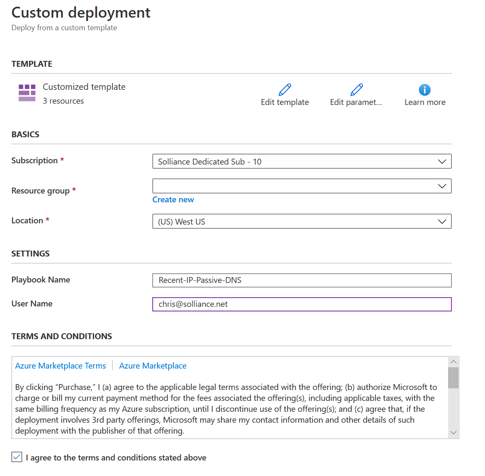

# Day 2 - Lab 2

DevIntersection Security Workshop

## Exercise 1 : Azure Sentinel Basics

1. Open the Azure Portal
2. Select **Azure Sentinel**

    

3. Select **+Add**

    

4. Select the **wssecuritySUFFIX** log analytics workspace, then select **Add Azure Sentinel**

5. Select **Logs**, notice your previous log analytics queries are displayed and available to run

6. Explore the various Azure Sentinel blade items

    

## Exercise 2 : Azure Sentinel Data Sources

1. In the Azure Sentinel blade, under **Configuration**, select **Data connectors**
2. Select **Azure Active Directory**

    

3. In the side dialog, notice the Data Types that will be imported (`SigninLogs` and `AuditLogs`)
4. Select **Open connector page**

    

    > **NOTE** You would need to have `global administrator` or `security administrator` access to the Azure AD tenant in order to make the connection. Unfortunately in these labs, your lab user does not have this level of access.

    

## Exercise 3 : Azure Sentinel Workbooks

1. In the Azure Sentinel blade, under **Threat Management**, select **Workbooks**
2. Select **Azure Security Center for IoT Alerts**

   

3. Select **Save**
4. For the workbook location, select **East US**
5. Select **OK**
6. Select **View saved workbook**

    

    > **NOTE** You would need to have setup the IoT labs in order to see events in this workbook.

7. Browse back to the Sentinel Workbooks blade
8. Select **Microsoft Web Application (WAF)- firewall events**
9. Select **Save**

    

10. For the workbook location, select **East US**
11. Select **OK**
12. Select **View saved workbook**

    > **NOTE** You would need to have completed the Web Application Gateway/Application Firewall lab in order to see events in this workbook.

## Exercise 2 : Azure Sentinel Hunting

1. In the Azure Sentinel blade, select **Hunting**
2. Review the page, notice it has several pre-built queries for `hunting` log data for events that are of interest

    

3. Select one of the items, it will display the details of what that item does:

    

## Exercise 3 : Azure Sentinel Incidents and Investigation

### Task 1: Setup Query Rule

1. In the Azure Sentinel blade, under **Configuration**, select **Analytics**
2. Select **+Create**, then select **Schedule query rule**

   

3. For the name, type **Custom threats**
4. For the tactics, select **Discovery**
5. For the severity, select **High**
6. Select **Next: Set rule logic**

    

7. For the rule query, type the following:

    ```output
    OrgSecurity_CL
    | where IsThreat_b == true
    | extend IPCustomEntity = IPAddress
    | extend HostCustomEntity = Computer
    ```

8. Select **Next: Incident Settings**
9. Ensure the **Create incidents from alerts trigger by this analytics rule** is toggled to **Enabled**
10. Ensure the **Group related alerts, trigger by this analytics rule, into incidents** is toggled to **Enabled**
11. Ensure the **Group related alerts, triggered by this analytics rule in incidents**
12. For the time frame, select **5 Hours**
13. For the grouping, select **Grouping alerts into a single incident if the selected entities match**
14. Select the **IP** entity
15. Select **Next: Automated response**
16. Select **Next: Review**
17. Select **Create**

### Task 2: Investigate Incident

1. In the **Azure Sentinel** blade, select **Incidents**.
2. TODO

## Exercise 4 : Azure Sentinel Notebooks

### Task 1: Import Notebook

1. In the **Azure Sentinel** blade, select **Notebooks**.
2. Review the list of sample notebooks
3. Select the **Go to your Notebooks** link, you will be redirected to the [Azure Notebooks](https://notebooks.azure.com) site.

    

4. If not already logged in, enter your lab Azure credentials.
5. Upload the `c:\LabFiles\artifacts\Azure Sentinel ML.ipynb` file
6. In another browser tab, navigate to the [Azure Active Directory page](https://portal.azure.com/#blade/Microsoft_AAD_IAM/ActiveDirectoryMenuBlade/Overview), copy your `Tenant ID` for use later.

    

7. Browse to your **wssecuritySUFFIX** log analytics workspace, copy the workspace id.

### Task 2: Create VirusTotal account

1. Open [VirusTotal web site](https://www.virustotal.com/gui/join-us)
2. Fill in the form details, select **Join us**
3. Log in to the website, in the top right navigation, select your user icon
4. Select **API Key**

    

5. Copy the API Key for later steps

    

### Task 3: Create MaxMind account

1. Open the MaxMind [sign up page](https://www.maxmind.com/en/geolite2/signup)
2. Fill out the sign up form, select **Continue**
3. Login to the MaxMind site
4. Select **My License Key**, then select **Generate new license key**

    

### Task 4: Execute a Hunt

1. Switch back to the NoteBook
2. Select **Run**, follow each of the cells as they are executed.  

    

3. Some cells will output information:

    

4. Some will prompt you for data such as the Workspace, TenantId and API keys:

    

5. Another cell will ask you to generate an access token

    

6. Copy the device code and click the **Copy code to dashboard and authenticate**

7. In the dialog that opens, copy the device code

8. Login using the lab username and password

9. Continue to run a few more cells, you should see a cell output the Log Analytics table and the `SigninLogs` schema:

    

10. One cell will display the queries available to you

    

11. The next cell will display kusto query details

    

12. The next cell will execute a query passing in parameters:

    

13. Run the remaining cells, you will make calls to the external API providers to enrich the log data with threat levels and IP Address analysis

## Exercise 5 : Extending Azure Sentinel Incidents (Optional)

This task requires registration to gain access to an API Key. It can take a few days to do this action.

### Task 1 : RiskIQ Api Key

1. Open a browser window to https://api.riskiq.net
2. In the left navigation, select the **Register Now** link
3. Fill out the form, login using the email you used in the form
4. Register and validate your email in the email
5. Login to the site, select the profile icon, then select **Developers->API**

    

6. Select **Show** for the User, record your API Key and Secret

### Task 2 : Extend Azure Sentinel

1. Open a browser window to https://github.com/Azure/Azure-Sentinel/tree/master/Playbooks/Enrich-SentinelIncident-RiskIQ-IP-Passive-DNS
2. Click the **Deploy to Azure** button
3. Be sure you are logged into your lab account
4. Select your subscription and resource group
5. For the playbook name, ensure **Recent-IP-Passive-DNS** is displayed
6. For your username, type the lab username

    

7. Select the **I agree..** checkbox
8. Select **Purchase**
9. In the Azure portal, navigate to your Azure Sentinel and your log analytics workspace
10. Select **Playbooks** from the Azure Sentinel navigation menu
11. Select the Recent-IP-Passive-DNS playbook by selecting the playbook name

    

12. Select **Edit** from the top menu of the playbook

    

13. There are four steps in this playbook requiring you to configure connections. Select a Connection from one of the steps requiring configuration and configure a new connection. Select the **Invalid** icon

    

14. Select **Sign in**

    

15. Enter your lab username and password.

    > **NOTE** For the connections to Azure Sentinel the user specified when establishing the connection must have sufficient permissions in the Azure Sentinel workspace to read the security alerts.

16. Expand the **For each** activity, select the the RiskIQ connection
17. Select the Invalid icon
18. For the name, type **RiskIQ**
19. Enter your RiskIQ API token and secret obtained from RiskIQ portal

    

20. Select **Save** from the top menu of the playbook to save the playbook
21. Navigate to your Azure Sentinel Analytics page and select an existing analytics rule or template item you wish to add the playbook automation.
22. Select Edit for the **Custom Threats** rule you created earlier

    > **NOTE** The Recent-IP-Passive-DNS playbook works with analytics rules which map IP address entities so make sure you are working with such a rule. For simple testing of the playbook automation you can use rule logic as shown below to force an alert creation with a specific IP address.

    ```output
    AzureActivity
    | take 1
    | extend IPCustomEntity = "144.91.119.160"
    ```

23. Navigate to the Automated response tab and place a check mark in the box for the Recent-IP-Passive-DNS playbook which will enable the playbook to run each time the analytic rule generates security alerts
24. Select **Save** to finish and return to the Analytics page
25. Navigate to your Azure Sentinel Incidents page
26. Locate the incident generated from the analytic rule configured to run the Recent-IP-Passive-DNS playbook automation and select **Full details** from the information pane
27. Select the **Comments** tab to see the enrichment added by the Recent-IP-Passive-DNS playbook automation. You can also view the information in the RiskIQ portal by following the link provided at the bottom of the comment

## Reference Links

- [What is Azure Sentinel](https://docs.microsoft.com/en-us/azure/sentinel/overview)
- [Investigate incidents with Azure Sentinel](https://docs.microsoft.com/en-us/azure/sentinel/tutorial-investigate-cases)
- Azure Sentinel Notebooks
- [Enrich Azure Sentinel security incidents with the RiskIQ Intelligence Connector](https://techcommunity.microsoft.com/t5/azure-sentinel/enrich-azure-sentinel-security-incidents-with-the-riskiq/ba-p/1534412)
